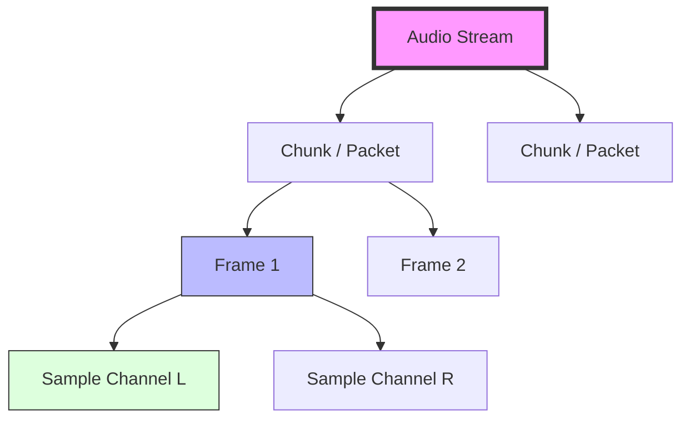
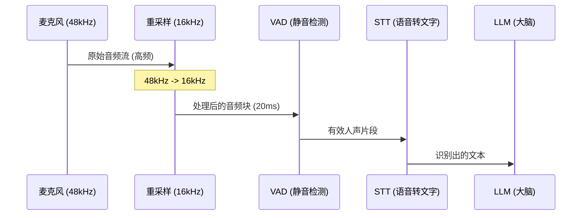

# 音频处理基础指南：Voice Agent 开发者必知 (视觉版)

作为 Voice Agent 开发者，你处理的是连续的**数字音频流**。本指南通过图解方式，帮你直观理解音频的核心属性。

---

## 1. 采样与量化：从波形到数字

声音在物理上是连续的波，计算机通过“采样”将其切碎。

### 视觉原理图
```text
振幅 (Amplitude)
 ^
 |      _---_                <- 原始模拟声波 (Analog Wave)
 |     /     \
 |----*-------*----*----> 时间 (Time)
 |   /|      /|   /|         <- 采样点 (Samples)
 |  / |     / |  / |
 0--+--+--+--+--+--+---->
    t1 t2 t3 t4 t5 t6        <- 采样率 (Sample Rate)
```

### 核心概念
- **Sample (采样)**：上图中的每一个 `*` 就是一个采样点。
- **Bit Depth (位深)**：决定了纵轴（振幅）能切多细。
    - **16-bit**：纵轴有 65,536 个刻度。语音模型识别效果最好。

---

## 2. 音频层级结构 (Hierarchy)

音频数据在内存中是按特定层级组织的。

### Mermaid 结构图


### ASCII 内存布局 (16-bit, Stereo)
```text
内存地址: | 0x00 | 0x01 | 0x02 | 0x03 | 0x04 | 0x05 | 0x06 | 0x07 |
数据内容: |  L-Low | L-High | R-Low | R-High |  L-Low | L-High | R-Low | R-High |
          \____________/ \____________/ \____________/ \____________/
             Sample L        Sample R        Sample L        Sample R
          \___________________________/ \___________________________/
                    Frame 1                         Frame 2
```

---

## 3. 典型 Voice Agent 管道 (Pipeline)

理解数据如何在不同组件间流动，以及采样率在哪里转换。



---

## 4. 关键参数速查表

| 参数 | 常用值 | 为什么？ |
| :--- | :--- | :--- |
| **采样率** | **16,000 Hz** | 语音 AI 模型的标准输入，兼顾性能与准确度。 |
| **声道** | **Mono (单声道)** | 语音识别不需要空间感，单声道数据量减半。 |
| **位深** | **16-bit** | 对应 Python 中的 `int16`。 |
| **包长度** | **20ms** | RTC (实时通信) 协议的最佳实践，延迟与效率的平衡。 |

---

## 5. 开发者公式 (必记)

### 20ms 的音频有多少个采样点？
如果采样率是 **16,000 Hz**：
> 16,000 samples/sec * 0.02 sec = **320 samples**

### 20ms 的音频占多少字节 (16-bit, Mono)？
> 320 samples * 2 bytes/sample = **640 bytes**

**这意味着你的代码中，每次处理的音频块 (Buffer) 大小通常就是 640 字节。**
