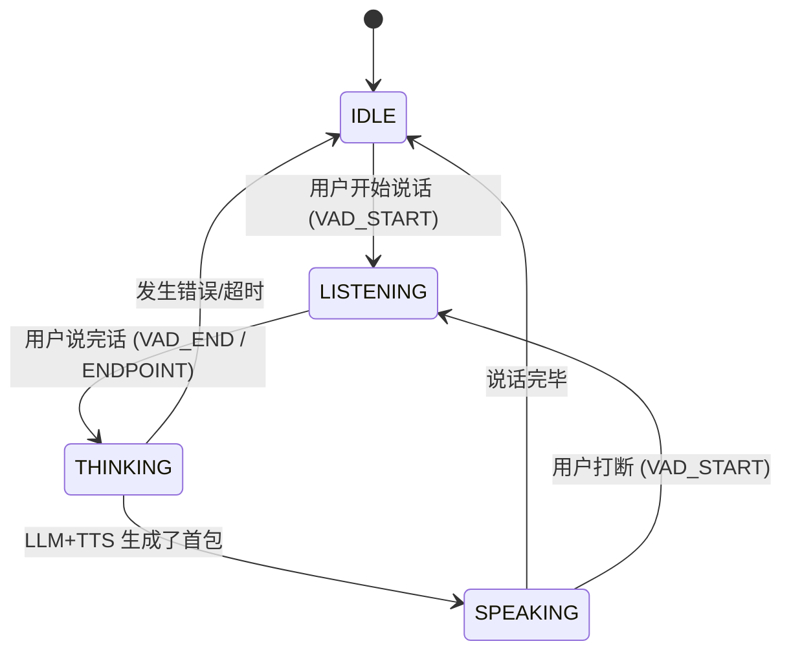

# 状态机 (FSM) 实战指南：Voice Agent 开发者的“定海神针”

在开发 Voice Agent 时，你是否遇到过这种尴尬情况：
- AI 还在说话，结果它又开始“思考”了。
- 用户已经停了，AI 却没反应。
- 用户打断了 AI，但 AI 的旧音频还在播放。

这种“逻辑打架”的根源在于：你没有使用**有限状态机 (Finite State Machine, FSM)**。

---

## 1. 为什么状态机是 Voice Agent 的灵魂？

Voice Agent 是一个**高度动态**的系统。它需要同时处理音频输入、模型推理、音频输出和用户打断。

如果你用 `if-else` 来写：
```python
# 糟糕的写法：面条代码
if user_is_speaking:
    if not ai_is_speaking:
        start_listening()
    else:
        interrupt_ai()
        start_listening()
# ... 很快你就不知道自己写到哪了
```

**状态机的核心价值：**
1.  **确定性**：在任何时刻，系统只能处于**一个**状态。
2.  **清晰性**：规定了什么状态下能做什么事，不能做什么事。
3.  **防御性**：防止了“一边说话一边思考”这种非法逻辑的发生。

---

## 2. 核心概念：四大要素

1.  **状态 (State)**：系统目前在干嘛？（例：`IDLE` 空闲, `LISTENING` 听取中）。
2.  **事件 (Event)**：发生了什么事？（例：`VAD_START` 检测到声音, `LLM_DONE` 思考完了）。
3.  **动作 (Action)**：发生转移时要做什么？（例：播放音频、清理缓存）。
4.  **转换 (Transition)**：从状态 A 变成状态 B 的过程。

---

## 3. Voice Agent 典型状态机模型

这是一个工业级语音助手最基础的状态转换图：



---

## 4. 从零实现：代码演进

### Level 1: 简单的类实现 (初学者版)

我们用一个简单的类来模拟状态切换。

```python
class SimpleVoiceAgentFSM:
    def __init__(self):
        self.state = "IDLE"

    def on_event(self, event):
        print(f"\n[事件] 收到: {event} | 当前状态: {self.state}")
        
        if self.state == "IDLE":
            if event == "USER_START_SPEAKING":
                self.transition_to("LISTENING")
        
        elif self.state == "LISTENING":
            if event == "USER_STOP_SPEAKING":
                self.transition_to("THINKING")
        
        elif self.state == "THINKING":
            if event == "AI_READY_TO_SPEAK":
                self.transition_to("SPEAKING")
        
        elif self.state == "SPEAKING":
            if event == "AI_FINISH_SPEAKING":
                self.transition_to("IDLE")
            elif event == "USER_START_SPEAKING":
                print("!!! [动作] 打断 AI，清空播放队列")
                self.transition_to("LISTENING")

    def transition_to(self, new_state):
        print(f"--- [转换] {self.state} -> {new_state} ---")
        self.state = new_state

# 测试运行
agent = SimpleVoiceAgentFSM()
agent.on_event("USER_START_SPEAKING")
agent.on_event("USER_STOP_SPEAKING")
agent.on_event("AI_READY_TO_SPEAK")
agent.on_event("USER_START_SPEAKING") # 模拟说话中被打断
```

---

### Level 2: 结合 Asyncio (进阶版)

在真实的 Voice Agent 中，状态切换通常伴随着异步操作（如取消正在运行的任务）。

```python
import asyncio

class VoiceAgent:
    def __init__(self):
        self.state = "IDLE"
        self.current_task = None

    async def handle_event(self, event):
        print(f"\n[State: {self.state}] 收到事件: {event}")

        if self.state == "SPEAKING" and event == "USER_START":
            await self.interrupt()
            self.state = "LISTENING"
            self.current_task = asyncio.create_task(self.do_listening())
            
        elif self.state == "IDLE" and event == "USER_START":
            self.state = "LISTENING"
            self.current_task = asyncio.create_task(self.do_listening())

    async def interrupt(self):
        if self.current_task:
            print("[Action] 正在取消当前的播放任务...")
            self.current_task.cancel()
            try:
                await self.current_task
            except asyncio.CancelledError:
                print("[Action] 播放任务已安全停止")

    async def do_listening(self):
        print("  [Listening...] 正在录音中")
        await asyncio.sleep(5)
        print("  [Listening] 录音完成")

# 真实场景下，你会使用专业的库如 `transitions` 或 `statemachine`
```

---

## 5. 为什么你应该在 Voice Agent 中使用它？

1.  **处理“打断”逻辑**：
    只有在 `SPEAKING` 状态下收到 `USER_START` 才是打断。如果在 `IDLE` 状态收到，那只是正常的开始。状态机让你能精准区分这些场景。

2.  **管理 UI/反馈**：
    你可以根据状态直接驱动前端 UI（如：`LISTENING` 时显示波动动效，`THINKING` 时显示转圈）。

3.  **处理超时**：
    你可以为 `LISTENING` 状态设置一个计时器。如果 10 秒没收到 `USER_STOP`，自动转换回 `IDLE`。

## 6. 给开发者的建议

- **不要过度设计**：一开始只需要 4-5 个核心状态即可。
- **记录日志**：每次状态转换必须打印日志，这是排查语音助手“莫名其妙没反应”的唯一手段。
- **异常处理**：确保每个状态在遇到异常（如网络错误）时都有一个路径能回到 `IDLE`，否则你的 Agent 就会卡死在某个状态。
